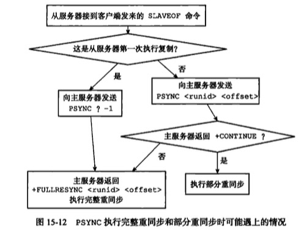

# 复制
slaveof ip port
## 旧版本

### 同步：sync


### 传播

为了让主从服务器再次回到一致状态， 主服务器需要对从服务器执行命令传播操作： 主服务器会将自己执行的写命令 —— 也即是造成主从服务器不一致的那条写命令 —— 发送给从服务器执行， 当从服务器执行了相同的写命令之后， 主从服务器将再次回到一致状态。

## 新版本
### 同步：psync
#### 完整同步
同旧版本
#### 部分同步
用于处理断线重连


* 偏移量
    * 表示主服务器的复制偏移量和从服务器的复制偏移量，简单理解就是记录每次复制的起点位置，当主服务器每次向从服务器传播n个字节的数据时，就将自己的复制偏移量加n,从服务器接受到主服务器发送过来的n个字节就将自己的偏移量也移动n个位置

* 复制积压缓冲器
    * 复制积压缓冲器是一个长度固定的先进先出的队里，并且这个队列的长度是固定（默认为1m）,每次当主服务器给从服务器发送命令的时候也会给自己的复制积压缓冲器写一份数据，并且复制积压缓冲区会把offset记录下来。这个复制积压缓冲区需要根据每秒写的数量和断开重连的时间来设置 
    * 当某一次复制断开以后，从服务器发送psync和自己的offset之后，主服务会根据偏移量去复制积压缓存区找，如果存在的话，回复从服务器开始部分同步模式。因为从服务可能不止一个，因此在同步的时候我们需要引入另外一个东西，机器号，根据机器号可以进行主从服务器的匹配。
* 机器号 runid
    * 服务器运行的机器号，因为新版同步的时候，主服务器会将自己的机器号发给从服务器，当断线之后从服务器再次向主服务器请求同步的时候会带着主服务器给他的主服务器的机器号。从这个角度也能推算出这次同步是sync还是psync.



## 复制实现
* 从服务器将客户端给定的主服务器ip port设置好
redisServer
    * slaveof是一个异步命令，从服务器完成设置工作后，即向客户端返回OK。而实际的复制工作才刚开始

```c
// 主服务器的地址
char *masterhost;               /* Hostname of master */
// 主服务器的端口
int masterport;                 /* Port of master */
```

* 建立套接字连接


* 发送ping请求


* 身份验证


* 发送端口信息
    * 从服务器向主服务器发生监听端口信息
        * replconf listening-port 12345
    * 主服务器将其保存在对应的redisClient.slave_listening_port中
    * 目前该属性唯一的作用是用于info replication打印从服务器端口号


* 同步
    * 同步之前（以上各个步骤），只有从服务器是主服务器的客户端，同步开始后，主服务器也是从服务器的客户端。


### 传播
同旧版本。

## 心跳检测
* 发生在命令传播阶段
* 从服务器每1秒向主服务器发送命令
    * replconf ack offset
* 该命令有如下作用：

### 检测网络连接状态

主服务器记录从服务器最后一次发送来replconf ack命令距离现在过了几秒（lag）

### 辅助实现min-slaves，防止主服务不安全写

min-slaves-to-write 3
min-slaves-max-lag 10

从服务器数量小于3或者3个从服务器的延迟都大于10，则主服务器拒绝写操作

### 检测命令丢失

当从服务器发送来的偏移量<主服务器发送来的偏移量，则主服务器认为命令丢失，将会在复制挤压缓冲区找到缺少的数据，发送给从服务器