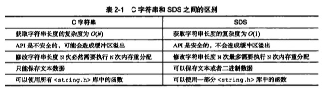

# 简单动态字符串
## 作用
作为Redis默认字符串表示
## 结构
```c
/*
 * 保存字符串对象的结构
 */
struct sdshdr {
    
    // buf 中已占用空间的长度
    int len;

    // buf 中剩余可用空间的长度
    int free;

    // 数据空间
    char buf[];
};
```
## 特点
* 常数复杂度获取字符串长度
* 杜绝缓冲区溢出
* 减少修改字符串时带来的内存重分配次数
    * 空间预分配
    * 惰性空间释放
* 二进制安全
* 兼容部分c字符串函数

