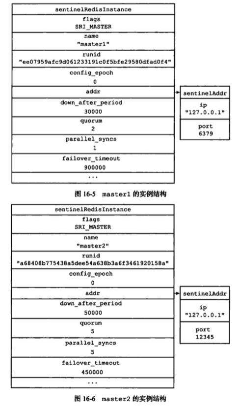
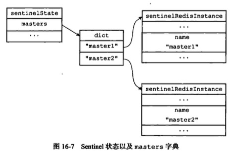
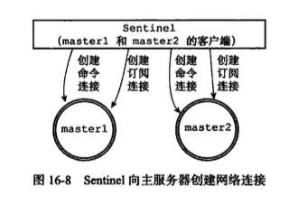
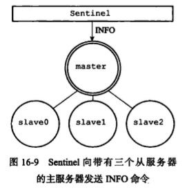
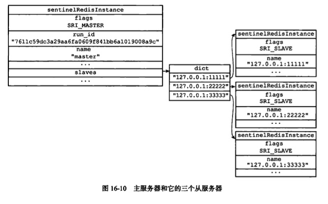

# Sentinel

HA解决方案：故障转移

## 启动并初始化Sentinel

### 初始化服务器
Sentinel不使用数据库，所以初始化不载入RDB或AOF文件

### 使用Sentinel专用代码
端口和命令表与普通服务器Redis不同

### 初始化Sentinel状态
```c
/* Main state. */
/* Sentinel 的状态结构 */
struct sentinelState {

    // 当前纪元
    uint64_t current_epoch;     /* Current epoch. */

    // 保存了所有被这个 sentinel 监视的主服务器
    // 字典的键是主服务器的名字
    // 字典的值则是一个指向 sentinelRedisInstance 结构的指针
    dict *masters;      /* Dictionary of master sentinelRedisInstances.
                           Key is the instance name, value is the
                           sentinelRedisInstance structure pointer. */

    // 是否进入了 TILT 模式？
    int tilt;           /* Are we in TILT mode? */

    // 目前正在执行的脚本的数量
    int running_scripts;    /* Number of scripts in execution right now. */

    // 进入 TILT 模式的时间
    mstime_t tilt_start_time;   /* When TITL started. */

    // 最后一次执行时间处理器的时间
    mstime_t previous_time;     /* Last time we ran the time handler. */

    // 一个 FIFO 队列，包含了所有需要执行的用户脚本
    list *scripts_queue;    /* Queue of user scripts to execute. */

} sentinel;
```
### 初始化Sentinel状态的masters属性
* Masters,保存了所有被这个 sentinel 监视的主服务器,字典的键是主服务器的名字,字典的值则是一个指向 sentinelRedisInstance 结构的指针。
* Sentinel的初始化将引发masters字典的初始化，而master字典的初始化是根据被载入的Sentinel配置文件来进行的。
```c
// Sentinel 会为每个被监视的 Redis 实例创建相应的 sentinelRedisInstance 实例
// （被监视的实例可以是主服务器、从服务器、或者其他 Sentinel ）
typedef struct sentinelRedisInstance {
    
    // 标识值，记录了实例的类型，以及该实例的当前状态
    int flags;      /* See SRI_... defines */
    
    // 实例的名字
    // 主服务器的名字由用户在配置文件中设置
    // 从服务器以及 Sentinel 的名字由 Sentinel 自动设置
    // 格式为 ip:port ，例如 "127.0.0.1:26379"
    char *name;     /* Master name from the point of view of this sentinel. */

    // 实例的运行 ID
    char *runid;    /* run ID of this instance. */

    // 配置纪元，用于实现故障转移
    uint64_t config_epoch;  /* Configuration epoch. */

    // 实例的地址
    sentinelAddr *addr; /* Master host. */

    // 用于发送命令的异步连接
    redisAsyncContext *cc; /* Hiredis context for commands. */

    // 用于执行 SUBSCRIBE 命令、接收频道信息的异步连接
    // 仅在实例为主服务器时使用
    redisAsyncContext *pc; /* Hiredis context for Pub / Sub. */

    // 已发送但尚未回复的命令数量
    int pending_commands;   /* Number of commands sent waiting for a reply. */

    // cc 连接的创建时间
    mstime_t cc_conn_time; /* cc connection time. */
    
    // pc 连接的创建时间
    mstime_t pc_conn_time; /* pc connection time. */

    // 最后一次从这个实例接收信息的时间
    mstime_t pc_last_activity; /* Last time we received any message. */

    // 实例最后一次返回正确的 PING 命令回复的时间
    mstime_t last_avail_time; /* Last time the instance replied to ping with
                                 a reply we consider valid. */
    // 实例最后一次发送 PING 命令的时间
    mstime_t last_ping_time;  /* Last time a pending ping was sent in the
                                 context of the current command connection
                                 with the instance. 0 if still not sent or
                                 if pong already received. */
    // 实例最后一次返回 PING 命令的时间，无论内容正确与否
    mstime_t last_pong_time;  /* Last time the instance replied to ping,
                                 whatever the reply was. That's used to check
                                 if the link is idle and must be reconnected. */

    // 最后一次向频道发送问候信息的时间
    // 只在当前实例为 sentinel 时使用
    mstime_t last_pub_time;   /* Last time we sent hello via Pub/Sub. */

    // 最后一次接收到这个 sentinel 发来的问候信息的时间
    // 只在当前实例为 sentinel 时使用
    mstime_t last_hello_time; /* Only used if SRI_SENTINEL is set. Last time
                                 we received a hello from this Sentinel
                                 via Pub/Sub. */

    // 最后一次回复 SENTINEL is-master-down-by-addr 命令的时间
    // 只在当前实例为 sentinel 时使用
    mstime_t last_master_down_reply_time; /* Time of last reply to
                                             SENTINEL is-master-down command. */

    // 实例被判断为 SDOWN 状态的时间
    mstime_t s_down_since_time; /* Subjectively down since time. */

    // 实例被判断为 ODOWN 状态的时间
    mstime_t o_down_since_time; /* Objectively down since time. */

    // SENTINEL down-after-milliseconds 选项所设定的值
    // 实例无响应多少毫秒之后才会被判断为主观下线（subjectively down）
    mstime_t down_after_period; /* Consider it down after that period. */

    // 从实例获取 INFO 命令的回复的时间
    mstime_t info_refresh;  /* Time at which we received INFO output from it. */

    /* Role and the first time we observed it.
     * This is useful in order to delay replacing what the instance reports
     * with our own configuration. We need to always wait some time in order
     * to give a chance to the leader to report the new configuration before
     * we do silly things. */
    // 实例的角色
    int role_reported;
    // 角色的更新时间
    mstime_t role_reported_time;

    // 最后一次从服务器的主服务器地址变更的时间
    mstime_t slave_conf_change_time; /* Last time slave master addr changed. */

    /* Master specific. */
    /* 主服务器实例特有的属性 -------------------------------------------------------------*/

    // 其他同样监控这个主服务器的所有 sentinel
    dict *sentinels;    /* Other sentinels monitoring the same master. */

    // 如果这个实例代表的是一个主服务器
    // 那么这个字典保存着主服务器属下的从服务器
    // 字典的键是从服务器的名字，字典的值是从服务器对应的 sentinelRedisInstance 结构
    dict *slaves;       /* Slaves for this master instance. */

    // SENTINEL monitor <master-name> <IP> <port> <quorum> 选项中的 quorum 参数
    // 判断这个实例为客观下线（objectively down）所需的支持投票数量
    int quorum;         /* Number of sentinels that need to agree on failure. */

    // SENTINEL parallel-syncs <master-name> <number> 选项的值
    // 在执行故障转移操作时，可以同时对新的主服务器进行同步的从服务器数量
    int parallel_syncs; /* How many slaves to reconfigure at same time. */

    // 连接主服务器和从服务器所需的密码
    char *auth_pass;    /* Password to use for AUTH against master & slaves. */

    /* Slave specific. */
    /* 从服务器实例特有的属性 -------------------------------------------------------------*/

    // 主从服务器连接断开的时间
    mstime_t master_link_down_time; /* Slave replication link down time. */

    // 从服务器优先级
    int slave_priority; /* Slave priority according to its INFO output. */

    // 执行故障转移操作时，从服务器发送 SLAVEOF <new-master> 命令的时间
    mstime_t slave_reconf_sent_time; /* Time at which we sent SLAVE OF <new> */

    // 主服务器的实例（在本实例为从服务器时使用）
    struct sentinelRedisInstance *master; /* Master instance if it's slave. */

    // INFO 命令的回复中记录的主服务器 IP
    char *slave_master_host;    /* Master host as reported by INFO */
    
    // INFO 命令的回复中记录的主服务器端口号
    int slave_master_port;      /* Master port as reported by INFO */

    // INFO 命令的回复中记录的主从服务器连接状态
    int slave_master_link_status; /* Master link status as reported by INFO */

    // 从服务器的复制偏移量
    unsigned long long slave_repl_offset; /* Slave replication offset. */

    /* Failover */
    /* 故障转移相关属性 -------------------------------------------------------------------*/


    // 如果这是一个主服务器实例，那么 leader 将是负责进行故障转移的 Sentinel 的运行 ID 。
    // 如果这是一个 Sentinel 实例，那么 leader 就是被选举出来的领头 Sentinel 。
    // 这个域只在 Sentinel 实例的 flags 属性的 SRI_MASTER_DOWN 标志处于打开状态时才有效。
    char *leader;       /* If this is a master instance, this is the runid of
                           the Sentinel that should perform the failover. If
                           this is a Sentinel, this is the runid of the Sentinel
                           that this Sentinel voted as leader. */
    // 领头的纪元
    uint64_t leader_epoch; /* Epoch of the 'leader' field. */
    // 当前执行中的故障转移的纪元
    uint64_t failover_epoch; /* Epoch of the currently started failover. */
    // 故障转移操作的当前状态
    int failover_state; /* See SENTINEL_FAILOVER_STATE_* defines. */

    // 状态改变的时间
    mstime_t failover_state_change_time;

    // 最后一次进行故障迁移的时间
    mstime_t failover_start_time;   /* Last failover attempt start time. */

    // SENTINEL failover-timeout <master-name> <ms> 选项的值
    // 刷新故障迁移状态的最大时限
    mstime_t failover_timeout;      /* Max time to refresh failover state. */

    mstime_t failover_delay_logged; /* For what failover_start_time value we
                                       logged the failover delay. */
    // 指向被提升为新主服务器的从服务器的指针
    struct sentinelRedisInstance *promoted_slave; /* Promoted slave instance. */

    /* Scripts executed to notify admin or reconfigure clients: when they
     * are set to NULL no script is executed. */
    // 一个文件路径，保存着 WARNING 级别的事件发生时执行的，
    // 用于通知管理员的脚本的地址
    char *notification_script;

    // 一个文件路径，保存着故障转移执行之前、之后、或者被中止时，
    // 需要执行的脚本的地址
    char *client_reconfig_script;

} sentinelRedisInstance;
```





### 创建连向主服务器的网络连接
* Sentinel成为主服务器的客户端，向主服务器发送命令，并从回复中获取相关的信息
* Sentinel创建两个连向主服务器的异步网络
    * 命令连接
    * 订阅连接，订阅_sentinel_:hello频道



## 获取主服务器信息



* 每10秒向主服务器发送**info命令**，并通过分析命令获取主服务器当前信息
    * 获取关于主服务器本身的信息
        * run_id
        * role
    * 获取主服务器属下所有从服务器信息
        * 用于更新主服务器实例结构的slaves字典




## 获取从服务器信息
当sentinel发现主服务器有新的从服务器出现时，Sentinel除了会为这个新的从服务器创建相应的实例结构之外，还创建到从服务器的命令连接和订阅连接
## 向主服务器，从服务器发生消息

## 接收来自主服务器和从服务器的频道消息

### 更新sentinels字典


### 创建连向其他Sentinel的命令连接

## 检测主观下线状态

## 检测客观下线状态

## 选择领头Sentinel

## 故障转移
