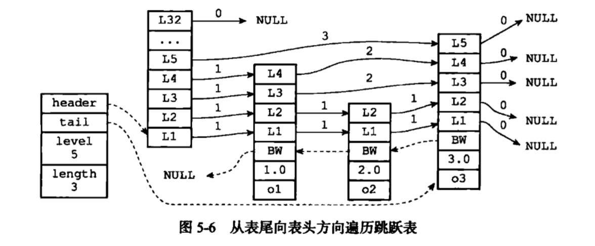

# 跳跃表
## 作用
* 有sorted set的底层实现之一
    * 如果一个有序集合包含的元素数量比较多，又或者有序集合中元素的成员是比较长的字符串时
## 结构
```c
typedef struct zskiplistNode {

    // 成员对象
    robj *obj;

    // 分值
    double score;

    // 后退指针
    struct zskiplistNode *backward;

    // 层
    struct zskiplistLevel {

        // 前进指针
        struct zskiplistNode *forward;

        // 跨度
        unsigned int span;

    } level[];

} zskiplistNode;
```
```c
/*
 * 跳跃表
 */
typedef struct zskiplist {

    // 表头节点和表尾节点
    struct zskiplistNode *header, *tail;

    // 表中节点的数量
    unsigned long length;

    // 表中层数最大的节点的层数
    int level;

} zskiplist;
```




* header：指向跳跃表头结点，其level数组保存了

## 时间复杂度
* 增加，查找，删除为O(logn)