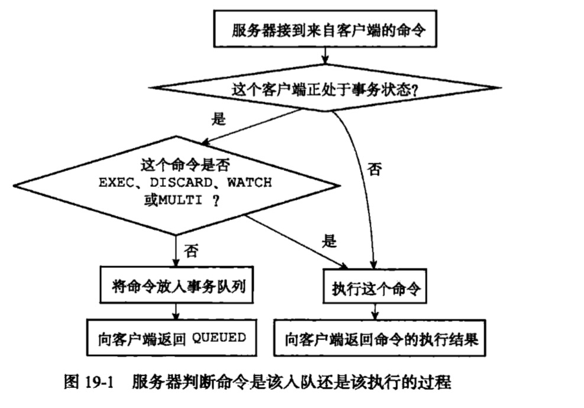
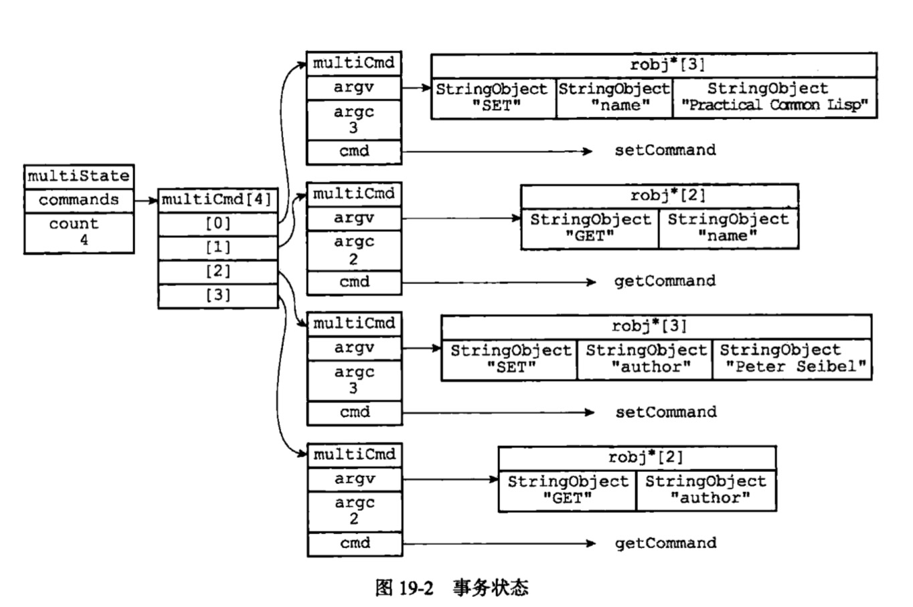
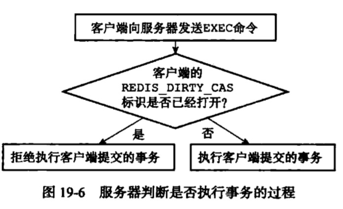

# 事务
## 事务开始
* MULTI命令标志事务开始，该命令将client从非事务状态转换到事务状态
    * 通过clientServer的flags属性中打开REDIS_MULTI标识完成的

redisClient
```c
// 客户端状态标志
int flags;  /* REDIS_SLAVE | REDIS_MONITOR | REDIS_MULTI ... */

```
## 命令入队



每个redisClient有自己的事务状态（multiState),每个事务状态包含一个事务队列（multiCmd数组）以及命令计数器，事务队列先进先出的方式保存入队的命令



redisClient
```c
// 事务状态
multiState mstate;      /* MULTI/EXEC state */
```

```c
/*
 * 事务状态
 */
typedef struct multiState {

    // 事务队列，FIFO 顺序,是一个数组
    multiCmd *commands;     /* Array of MULTI commands */

    // 已入队命令计数
    int count;              /* Total number of MULTI commands */
    int minreplicas;        /* MINREPLICAS for synchronous replication */
    time_t minreplicas_timeout; /* MINREPLICAS timeout as unixtime. */
} multiState;
```
```c
/*
 * 事务命令
 */
typedef struct multiCmd {

    // 参数
    robj **argv;

    // 参数数量
    int argc;

    // 命令指针
    struct redisCommand *cmd;

} multiCmd;
```
## 事务执行
当处于事务状态的客户端向服务器发送EXEC命令时，这个EXEC命令将立即被服务器执行。服务器会遍历这个客户端的事务队列，执行队列中保存的所有命令，最后将执行命令所得的结果全部返回给客户端。

# watch
## 使用watch命令监视数据库键
watch是一个乐观锁，它在EXEC执行前，监视任意数量的数据库键，并在EXEC执行时，检查被监视的键是否至少有一个已经被修改，如果是，服务器将拒绝执行事务，返回代表事务失败的空回复

redisDb
```c
// 正在被 WATCH 命令监视的键
dict *watched_keys; /* WATCHED keys for MULTI/EXEC CAS */
```

```bash
watch "name" "age"
```


## 监视机制的触发
所有对数据库进行修改的命令，在执行后都会调用multi.c/touchWatchKey函数对watched_keys字典进行检查，查看是否有客户端正在监视刚被修改的数据库键，如果有，则将监视被修改键的客户端的REDIS_DIRTY_CAS标识打开，表示该客户端的事务安全性已经被破坏。

## 判断事务是否安全

