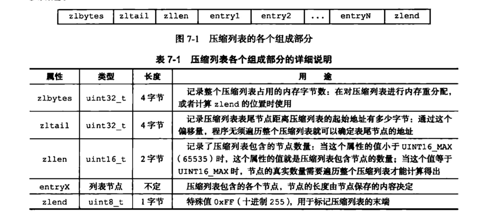
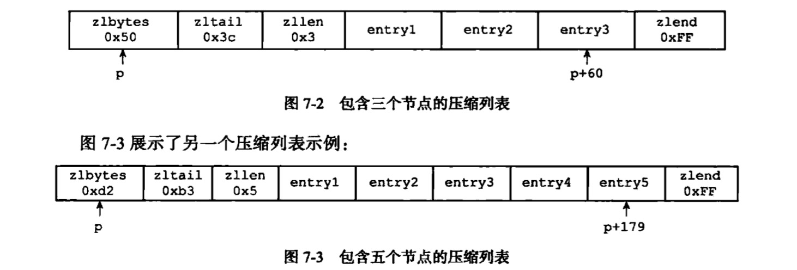
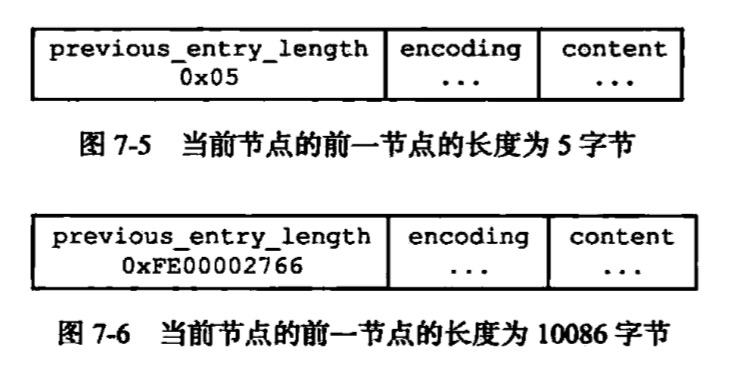
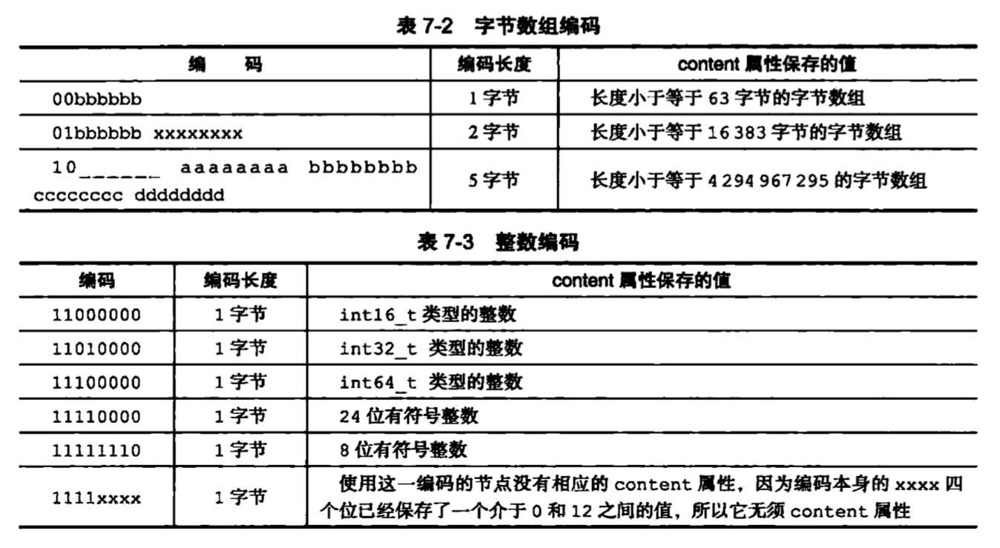
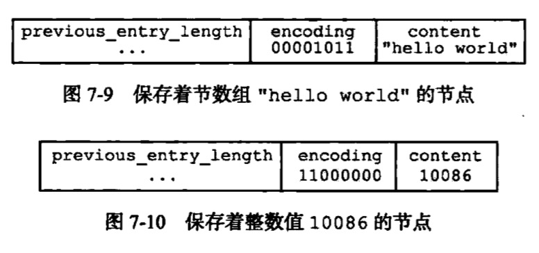

# 压缩列表，为了节省内存
## 作用
* list key，hash key，sorted set key的底层实现之一
    * 当一个list key只包含少量列表项，并且每个列表项要么就是小整数值，要么就是长度比较短的字符串
        * 两个条件
            * 元素数量小于512
            * 每个元素长度小于64字节
        * 这两个上限可以通过配置文件修改
    * 当一个hash key只包含少量键值对，并且每个键值对的键和值要么就是小整数值，要么就是长度比较短的字符串
## 结构
* ziplist并没有定义明确的结构体
* 由一系列特殊编码的连续内存块组成的顺序型数据结构

* previous_entry_length
    * 用于从表尾向表头遍历
        * 记录前一个节点的长度，所有程序可以通过指针运算，根据当前节点的起始地址来计算出前一个节点的起始地址
* encoding
    * 记录content属性所保存数据的类型以及长度

    

* content
    * 保存节点值，可以是一个字节数组或整数
    

## 连锁更新

## 时间复杂度
* 